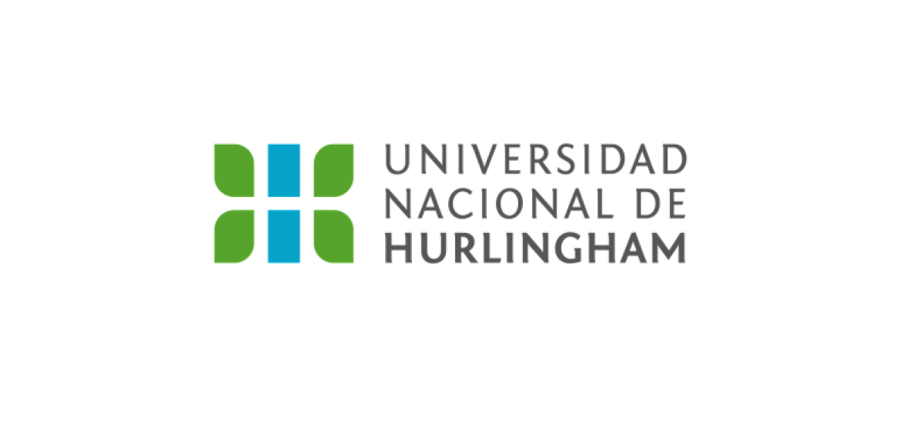

#  Presentación Zamorano Daniel
Mi nombre es Daniel Zamorano, tengo 38 años y estoy estudiando la tecnicatura en programación en la UNAHUR. 
Arranque en 2022, mi mujer se recibió de Enfermera en el establecimiento y me sugirió que podía estudiar alguna carrera que me interesara. Con el apoyo de la familia y juntando algo de ganas elegí esta carrera por mi cariño a la tecnología. 
Debo confesar que tiene sus muchas horas de practica y al nunca estar empapado en todo lo respectivo a la informática me costó. Lo tomo como un gran desafío, es sumamente interesante por las posibilidades que laborales.
Aspiro a ser trabajador nómade, trabajo actualmente en una oficina, disponer de mis tiempos y poder vivir una vida diferente a lo normal establecido. Existen momentos de arrepentimiento de esta carrera por su complejidad y por qué mi base en realidad estaba orientada a la Medicina (Kinesiología).
Noto compañeros con ideas innovadoras distintas a las mías, provocan algo de frustración y admiración a la vez. Aprendo de ellos y trato de no quedarme tan atrás. Como mencione es un desafío que quiero lograr. Sin más por el momento. Saludos.

