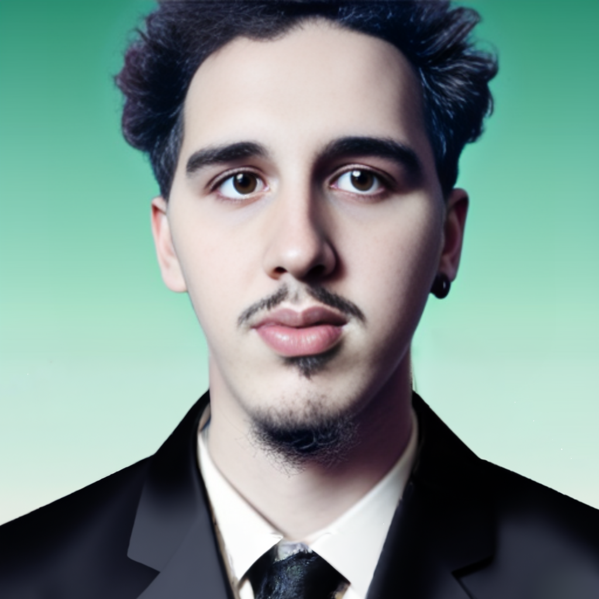

# Branko Muruaga

Hola, me llamo **Branko** y este es mi tercer cuatrimestre en esta carrera, estoy a dos materias de segundo año.
En 2019 curse **Diseño industrial** hasta el 2020 que vino la pandemia, donde termine dejando ya que no terminaba de gustarme.

En 2021 consegui un trabajo en una fabrica de vasos en donde trabaje por casi 2 años. Como el ambiente laboral, sueldo y condiciones de trabajo no eran buenas me empeñe en conseguir algo mejor.

Me incribi en la carrera de programacion en 2022 ya que un amigo se iba a inscribir y me inspiro a hacerlo tambien. Finalmente mi amigo nunca se inscribio asi que quede por mi cuenta. 

A finales del 2022 consegui trabajo en una consultora como asistente RPA (Robotic process automation) donde las condiciones laborales son mil veces mejores y en donde me siento muy a gusto trabajando. 

Pienso seguir aprendiendo de programacion para conseguir otros mejores trabajos y algun dia trabajar en el extranjero, ya que una de mis metas es viajar por el mundo.

Siempre me gusto la computacion aunque nunca habia indagado muy profundo, pero me di cuenta que me encanta, y estoy bastante seguro que esto es lo que quiero hacer... no voy a decir que para siempre, pero si por mucho tiempo. Me encanta pensar cada proyecto como un acertijo a resolver, y usar la creatividad para resolverlo.

Estuve investigando mucho sobre Inteligencia artificial, y me interesa bastante. Esta imagen mia la cree con Stable Difussion. Me quedo muy bien asi que ahora la uso en todos lados. Quiza en cuanto termine esta carrera podria meterme a la de IA, pero bueno, eso se vera

## Mis gustos

- Desde los 15 años que me encanta el anime. De chico, imagino que como muchos aficionados del anime, queria crear mi propio anime, por lo que me empeñe en aprender a dibujar hasta que llegue a un nivel medio, aprendi a hacer animaciones y a editar. Se me cayo el sueño cuando entendi cuanto les costaba a las casas animadoras crear un solo capitulo. 

- Pero igualmente descubri que me encanta dibujar y el anime, y claro, dibujar anime

- Me encanta la astronomia, y estudiar como funciona el universo

- De la fascinacion por el cosmos derivo mi fasinacion por la fisica tambien, claro que solo por la parte divertida, nada de formulas muy complejas.

- Mi proximo objetivo es poder mudarme solo y, si se puede, tener un gato, al cual llamaria Orion, como el gato de "Hombres de negro"
